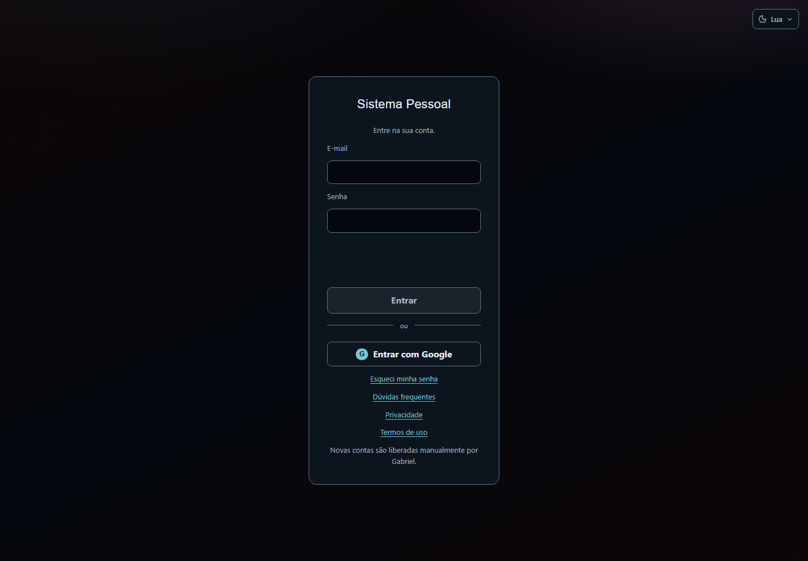
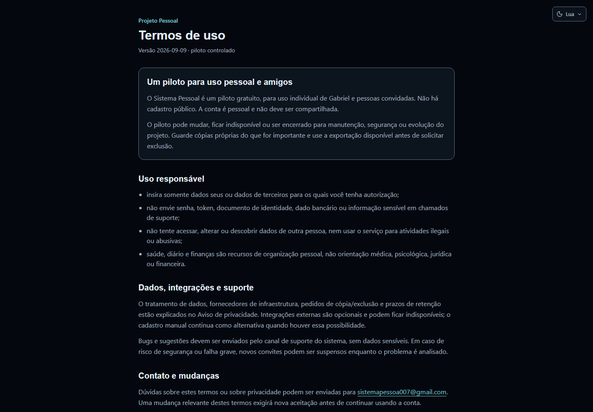
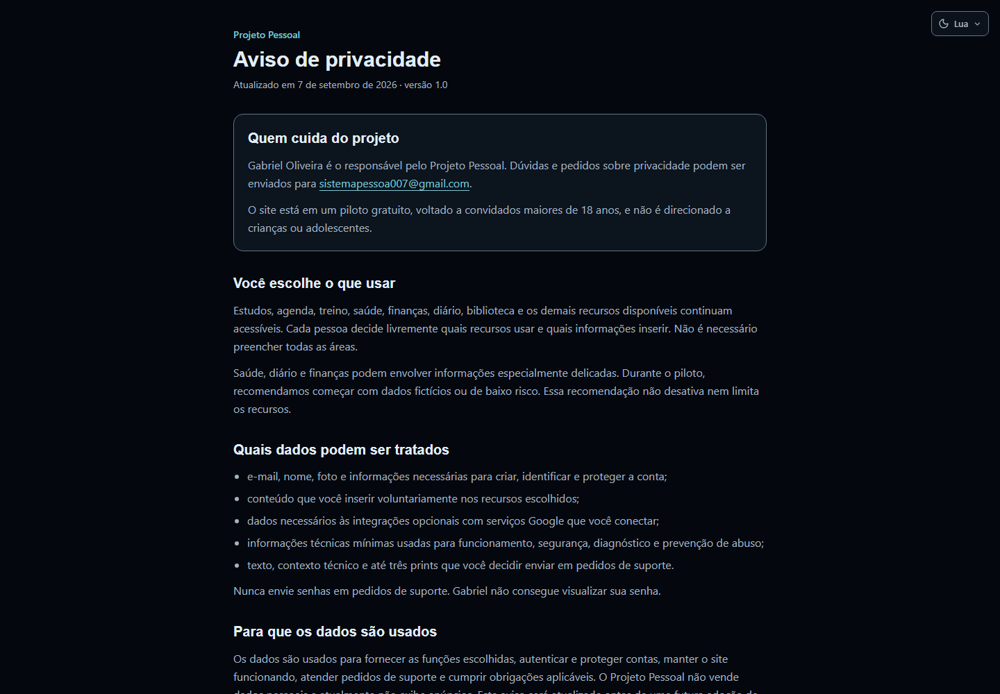

# Sistema Pessoal - guia rápido para amigos

> **Aviso importante - o site está em beta.** Algumas páginas ainda podem
> apresentar comportamento inesperado, mudanças de layout ou funções
> incompletas. **Programação, Projetos, Finanças e Saúde** estão, neste momento,
> na fase de planejamento; não trate essas áreas como versões finais.

## Para que serve

O Sistema Pessoal é um espaço privado para organizar diferentes partes da vida
em uma única conta. Cada pessoa enxerga somente os próprios registros e escolhe
quais áreas deseja usar.

Exemplos práticos:

- em **Treino**, registrar exercícios, cargas, repetições e evolução corporal;
- em **Estudos**, organizar matérias, cursos, redações, ENEM e revisões;
- em **Biblioteca**, catalogar filmes, séries, animes, mangás, livros, podcasts,
  vídeos e artigos;
- em **Agenda**, reunir compromissos pessoais e, opcionalmente, conectar o
  Google Calendar;
- em **Idiomas e Diário**, acompanhar objetivos e registros pessoais sem
  misturá-los com os dados de outros usuários;
- **Projetos, Programação, Finanças e Saúde** aparecem como áreas em
  planejamento e serão amadurecidas gradualmente.

Alguns preenchimentos consultam serviços externos, como Google, YouTube, TMDB,
AniList, Kitsu ou Jikan. Essas consultas são auxiliares: se alguma fonte ficar
indisponível, o cadastro manual continua funcionando. Google Places permanece
desativado para manter o piloto gratuito.

## 1. Como receber acesso

Não existe cadastro público. Gabriel cria cada conta individualmente e envia o
acesso por uma conversa privada.

Você pode entrar de duas formas:

### E-mail e senha temporária

1. Abra <https://expansiondominionpersonaledition.vercel.app/login>.
2. Digite o e-mail cadastrado e a senha temporária recebida.
3. Clique em **Entrar**.
4. No primeiro acesso, aceite os Termos de uso.
5. Em **Configurações > Alterar senha**, escolha uma senha pessoal com pelo
   menos 12 caracteres.

### Entrar com a própria conta Google

1. Informe a Gabriel o e-mail principal da conta Google que você usará.
2. Aguarde a confirmação de que esse mesmo e-mail foi liberado no piloto.
3. Na tela de login, clique em **Entrar com Google**.
4. Escolha a conta autorizada e conclua o consentimento do Google.
5. Leia e aceite os Termos de uso do Sistema Pessoal.

O e-mail cadastrado no Sistema Pessoal deve ser exatamente o mesmo retornado
pela conta Google. O acesso ao Google Calendar e ao YouTube é opcional e é
solicitado separadamente dentro de Configurações.

## 2. Primeiro acesso e Termos de uso

Antes de abrir os módulos, o site apresenta os Termos de uso. Leia o conteúdo,
marque a caixa de aceite e confirme. A conta é individual: não compartilhe senha
ou sessão com outra pessoa.

O piloto pode mudar ou ficar temporariamente indisponível. Guarde cópias próprias
do que for importante e use a exportação antes de solicitar uma exclusão.

## 3. Escolha apenas o que fizer sentido

Você não precisa preencher todas as áreas. Um começo simples pode ser:

1. criar um treino e registrar a próxima sessão;
2. cadastrar uma matéria ou curso em andamento;
3. adicionar um filme, anime, mangá ou livro à Biblioteca;
4. colocar um compromisso na Agenda;
5. explorar os demais módulos somente quando precisar.

Exemplo: quem quer apenas organizar estudos pode ignorar Treino e Biblioteca.
Quem quer catalogar entretenimento pode começar apenas pela Biblioteca. Os dados
de uma área não são obrigatórios para usar outra.

## 4. Privacidade e uso responsável

O Aviso de privacidade explica quem cuida do projeto, quais informações podem ser
armazenadas e como solicitar exportação ou exclusão.

Durante o piloto:

- comece com dados fictícios ou de baixo risco;
- não envie documentos de identidade, dados bancários ou senhas;
- não coloque dados de terceiros sem autorização;
- revise textos e imagens antes de enviá-los ao suporte;
- lembre que integrações externas recebem a consulta necessária para responder.

## 5. Google Calendar e YouTube são opcionais

Entrar com Google identifica sua conta no site. Conectar Google Calendar ou
YouTube concede permissões adicionais e independentes.

- **Calendar:** pode sincronizar o calendário principal enquanto o site estiver
  aberto.
- **YouTube:** pode listar playlists autorizadas para você escolher vídeos.
- Você pode conectar apenas um dos serviços, ambos ou nenhum.
- A conta usada nas integrações pode ser escolhida durante o consentimento.
- Como os aplicativos Google ainda estão em modo de teste, pode ser necessário
  reconectar uma integração depois de alguns dias.

## 6. Ajuda, perda de acesso e exclusão

Se perder o acesso, fale com Gabriel pela mesma conversa privada usada para
receber a conta. Nunca envie sua senha. A recuperação é tratada manualmente após
confirmar sua identidade.

Para relatar um problema, use **Perfil e configurações > Reportar um problema**.
Informe o módulo, o que tentou fazer, o que esperava e o que aconteceu. Remova
informações pessoais antes de anexar um print.

Pedidos de exportação e exclusão ficam disponíveis nas configurações. Registrar
o pedido não apaga a conta imediatamente; Gabriel confirma a identidade antes
de qualquer operação irreversível.

## Roteiro curto para apresentar o site

Este guia pode virar um vídeo de 45 a 60 segundos:

1. “Sua rotina em um só lugar” - mostrar a tela inicial;
2. mostrar rapidamente Treino, Estudos e Biblioteca;
3. mostrar Agenda, Projetos e Diário;
4. explicar que cada conta é privada e separada;
5. mostrar o login, o aceite dos termos e a troca da senha;
6. encerrar com “piloto gratuito para amigos, ainda em evolução”.

Capturas usadas em vídeos devem conter somente dados fictícios e nunca mostrar
e-mail, agenda, diário, chaves ou outras informações pessoais.
